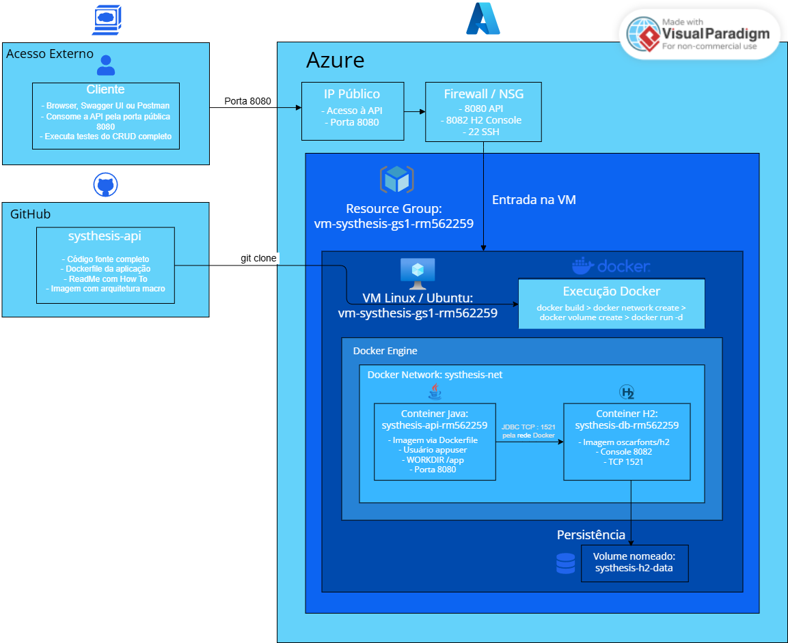

# Systhesis API

> **API REST para Simulação Gamificada de Gestão de Recursos em Colônias Espaciais**

Projeto desenvolvido para a disciplina de **Java Advanced — Global Solution 2026** da **FIAP**.

---

## Índice

- [Descrição do Projeto](#-descrição-do-projeto)
- [Objetivo da Solução](#-objetivo-da-solução)
- [Funcionalidades Principais](#-funcionalidades-principais)
- [Tecnologias Utilizadas](#-tecnologias-utilizadas)
- [Arquitetura do Projeto](#-arquitetura-do-projeto)
- [Arquitetura Macro DevOps em Nuvem](#-arquitetura-macro-devops-em-nuvem)
- [How To DevOps — Execução em Nuvem na Azure](#-how-to-devops--execução-em-nuvem-na-azure)
- [Modelagem Avançada](#-modelagem-avançada)
- [Segurança](#-segurança)
- [Endpoints Principais](#-endpoints-principais)
- [Como Executar Localmente](#-como-executar-localmente)
- [Como Testar a API](#-como-testar-a-api)
- [Usuários de Teste](#-usuários-de-teste)
- [Links Importantes](#-links-importantes)
- [Integrantes](#-integrantes)
- [Requisitos Atendidos](#-requisitos-atendidos)

---

## Descrição do Projeto

O **Systhesis** é uma API REST educacional e gamificada em que o aluno assume o papel de **comandante de uma colônia espacial** na Lua ou em Marte. Para manter a base em operação, ele deve administrar recursos essenciais como água, energia, oxigênio, alimento e temperatura, além de responder a desafios científicos propostos por missões educacionais.

A cada missão concluída, a colônia acumula pontos, subindo no ranking global. Eventos aleatórios — como tempestades solares, falhas energéticas, vazamentos de água e perdas de colheita — desafiam o aluno a tomar decisões críticas, simulando situações reais de gestão de recursos em ambientes extremos.

A API expõe todos os recursos necessários para que uma aplicação front-end (web ou mobile) consuma os dados e implemente a experiência gamificada completa.

---

## Objetivo da Solução

O Systhesis tem como objetivo estimular:

- **Aprendizado por simulação** — o aluno aprende conceitos de física, biologia e sustentabilidade ao gerir recursos reais de uma colônia espacial.
- **Tomada de decisão** — eventos inesperados exigem priorização de recursos sob pressão.
- **Raciocínio lógico e matemático** — as perguntas das missões exigem cálculo e raciocínio aplicado.
- **Gestão de recursos e sustentabilidade** — escassez de água, energia e alimento são desafios reais transpostos para o contexto espacial.
- **Engajamento tecnológico** — a gamificação aumenta a motivação e a retenção de conteúdo em ambientes educacionais.

---

## Funcionalidades Principais

| Funcionalidade | Descrição |
|---|---|
| **Cadastro e Login** | Criação de conta com perfil ALUNO, PROFESSOR ou ADMINISTRADOR |
| **Autenticação JWT** | Token Bearer gerado no login e exigido nos endpoints protegidos |
| **Gerenciamento de Colônias** | CRUD completo para criação e administração de bases espaciais |
| **Controle de Recursos** | Campos diretos na colônia: água, energia, oxigênio, alimento e temperatura |
| **Eventos de Impacto** | Quatro tipos de eventos que reduzem recursos específicos (campos diretos + RecursoColonia) |
| **Missões Educacionais** | Desafios com perguntas de múltipla escolha vinculados a planetas e dificuldades |
| **Tentativas de Resposta** | Registro das respostas dos alunos com correção automática |
| **Sistema de Pontuação** | Respostas corretas adicionam pontos e sincronizam `pontuacaoTotal`, `xp` e `nivel` |
| **Sistema de Progressão** | Colônia evolui de nível 1 a 5 conforme XP acumulado pelas tentativas corretas |
| **Ranking Global** | Classificação pública das colônias ordenadas por pontuação total |
| **Documentação Swagger** | Interface interativa para exploração e teste de todos os endpoints |

---

## Tecnologias Utilizadas

| Tecnologia               | Versão | Finalidade |
|--------------------------|---|---|
| **Java**                 | 21 | Linguagem principal |
| **Spring Boot**          | 3.2.5 | Framework principal |
| **Spring Web**           | — | Criação de endpoints REST |
| **Spring Data JPA**      | — | Persistência e repositórios |
| **Spring Security**      | — | Autenticação e autorização |
| **Java JWT**             | 0.11.5 | Geração e validação de tokens JWT |
| **Spring Validation**    | — | Validação de dados de entrada |
| **Lombok**               | — | Redução de boilerplate (getters, builders, etc.) |
| **Spring Boot DevTools** | — | Recarregamento automático em desenvolvimento |
| **Springdoc OpenAPI**    | 2.5.0 | Documentação Swagger/OpenAPI |
| **H2 Database**          | — | Banco de dados em memória para testes e deploy |
| **Maven**                | 3.x | Gerenciamento de dependências e build |
| **Render**               | — | Plataforma de deploy público da API |
| **Docker**               | — | Containerização da aplicação e do banco H2 |
| **Dockerfile**           | — | Geração da imagem personalizada da API |
| **Azure Virtual Machine**| Ubuntu Linux | Execução da aplicação em ambiente de nuvem |
| **Azure NSG / Firewall** | — | Liberação das portas 22, 8080, 8082 e 1521 |

---

## Arquitetura do Projeto

O projeto segue a **arquitetura em camadas** padrão do ecossistema Spring Boot, garantindo separação de responsabilidades e facilidade de manutenção.

```
controller   →  recebe requisições HTTP, transfere ao service, retorna DTOs
service      →  contém a lógica de negócio e orquestra as operações
repository   →  acesso ao banco de dados via Spring Data JPA
entity       →  mapeamento das tabelas do banco com anotações JPA
dto          →  objetos de transferência de dados (request e response)
enums        →  tipos enumerados (Planeta, TipoRecurso, StatusColonia, PerfilUsuario)
exception    →  exceções customizadas e handler global de erros
security     →  filtro JWT e serviço de geração/validação de tokens
config       →  configurações de segurança, CORS, OpenAPI e dados iniciais
```

### Estrutura de Pastas

```
systhesis-api/
├── src/
│   └── main/
│       ├── java/br/com/fiap/systhesis/
│       │   ├── config/
│       │   │   ├── CorsConfig.java
│       │   │   ├── DataLoader.java
│       │   │   ├── OpenApiConfig.java
│       │   │   └── SecurityConfig.java
│       │   ├── controller/
│       │   │   ├── AuthController.java
│       │   │   ├── ColoniaController.java
│       │   │   ├── EventoController.java
│       │   │   ├── HomeController.java
│       │   │   ├── MissaoController.java
│       │   │   ├── RankingController.java
│       │   │   └── TentativaController.java
│       │   ├── dto/
│       │   │   ├── CadastroUsuarioRequest.java
│       │   │   ├── ColoniaRequest.java
│       │   │   ├── ColoniaResponse.java
│       │   │   ├── ErroResponse.java
│       │   │   ├── EventoRequest.java
│       │   │   ├── EventoResponse.java
│       │   │   ├── LocalizacaoResponse.java
│       │   │   ├── LoginRequest.java
│       │   │   ├── MissaoRequest.java
│       │   │   ├── MissaoResponse.java
│       │   │   ├── RecursoColoniaResponse.java
│       │   │   ├── TentativaRequest.java
│       │   │   ├── TentativaResponse.java
│       │   │   ├── TokenResponse.java
│       │   │   └── UsuarioResponse.java
│       │   ├── entity/
│       │   │   ├── Colonia.java
│       │   │   ├── Conquista.java
│       │   │   ├── Evento.java              ← classe abstrata (herança JPA)
│       │   │   ├── FalhaEnergetica.java
│       │   │   ├── LocalizacaoEspacial.java ← @Embeddable
│       │   │   ├── Missao.java
│       │   │   ├── Pergunta.java
│       │   │   ├── PerdaColheita.java
│       │   │   ├── RecursoColonia.java      ← chave composta @EmbeddedId
│       │   │   ├── RecursoColoniaId.java    ← @Embeddable (chave composta)
│       │   │   ├── TempestadeSolar.java
│       │   │   ├── Tentativa.java
│       │   │   ├── Usuario.java
│       │   │   └── VazamentoAgua.java
│       │   ├── enums/
│       │   │   ├── PerfilUsuario.java
│       │   │   ├── Planeta.java
│       │   │   ├── StatusColonia.java
│       │   │   └── TipoRecurso.java
│       │   ├── exception/
│       │   │   ├── CredenciaisInvalidasException.java
│       │   │   ├── EmailJaCadastradoException.java
│       │   │   ├── GlobalExceptionHandler.java
│       │   │   └── RecursoNaoEncontradoException.java
│       │   ├── repository/
│       │   │   ├── ColoniaRepository.java
│       │   │   ├── EventoRepository.java
│       │   │   ├── MissaoRepository.java
│       │   │   ├── PerguntaRepository.java
│       │   │   ├── RecursoColoniaRepository.java
│       │   │   ├── TentativaRepository.java
│       │   │   └── UsuarioRepository.java
│       │   ├── security/
│       │   │   ├── JwtAuthFilter.java
│       │   │   └── JwtService.java
│       │   └── service/
│       │       ├── AuthService.java
│       │       ├── ColoniaService.java
│       │       ├── EventoService.java
│       │       ├── MissaoService.java
│       │       └── TentativaService.java
│       └── resources/
│           └── application.properties
├── Dockerfile
└── pom.xml
```

---

## Arquitetura Macro DevOps em Nuvem

A arquitetura macro abaixo representa a execução da solução **Systhesis API** em ambiente de nuvem, utilizando **Azure Virtual Machine**, **Docker Engine**, container da aplicação Java e container do banco de dados H2.



### Componentes da arquitetura

| Componente | Função |
|---|---|
| **Cliente / Avaliador** | Acessa a API pela porta pública `8080`, utilizando navegador, Swagger UI ou Postman |
| **GitHub** | Armazena o código-fonte completo, Dockerfile, README, tutorial de execução e imagem da arquitetura macro |
| **Azure** | Ambiente de nuvem utilizado para hospedar a VM Linux |
| **IP Público** | Permite o acesso externo à aplicação publicada na VM |
| **Firewall / NSG** | Controla as portas liberadas para acesso externo |
| **VM Linux / Ubuntu** | Máquina virtual onde o Docker Engine é instalado e os containers são executados |
| **Docker Engine** | Responsável por criar e executar os containers da solução |
| **Docker Network `systhesis-net`** | Rede Docker responsável pela comunicação interna entre o container da API e o container do banco |
| **Container Java `systhesis-api-rm562259`** | Container da aplicação Java/Spring Boot, criado a partir do Dockerfile |
| **Container H2 `systhesis-db-rm562259`** | Container do banco de dados H2, executado separadamente da aplicação |
| **Volume `systhesis-h2-data`** | Volume nomeado utilizado para persistência dos dados do banco |
| **Porta `8080`** | Acesso externo à API Java |
| **Porta `8082`** | Acesso externo ao H2 Console |
| **Porta `1521`** | Porta TCP utilizada pela aplicação para conectar ao banco H2 |
| **Porta `22`** | Acesso SSH à VM Linux |

### Fluxo da solução

1. O avaliador acessa a API pelo navegador, Swagger UI ou Postman.
2. A requisição chega no **IP público** da VM Azure.
3. O **Firewall / NSG** libera o tráfego da porta necessária.
4. A VM Linux recebe a requisição e encaminha para o container da aplicação Java.
5. A aplicação Java executa dentro do container `systhesis-api-rm562259`.
6. A API se comunica com o banco H2 através da rede Docker `systhesis-net`.
7. O banco H2 grava os dados no volume nomeado `systhesis-h2-data`.
8. As evidências da execução são obtidas por comandos como `docker ps`, `docker logs`, `docker exec`, `whoami`, `pwd`, `ls -l` e consultas `SELECT` no banco.

---

## How To DevOps — Execução em Nuvem na Azure

Este tutorial descreve como executar a aplicação **desde o clone do repositório até os testes em nuvem**, conforme solicitado na entrega de DevOps.

### Pré-requisitos

- Conta ativa na Microsoft Azure
- Azure CLI instalado ou Azure Cloud Shell
- Git
- Acesso SSH à VM
- Docker instalado na VM
- Repositório clonado com o código-fonte completo

### 1. Criar o Resource Group

```bash
az group create --name rg-systhesis-gs1-rm562259 --location canadacentral
```

### 2. Criar a VM Linux na Azure

```bash
az vm create --resource-group rg-systhesis-gs1-rm562259 --name vm-systhesis-gs1-rm562259 --image Ubuntu2204 --size Standard_B2ats_v2 --admin-username azureuser --generate-ssh-keys --public-ip-sku Standard
```

### 3. Liberar as portas no Firewall / NSG

```bash
az vm open-port --resource-group rg-systhesis-gs1-rm562259 --name vm-systhesis-gs1-rm562259 --port 22 --priority 1000
```

```bash
az vm open-port --resource-group rg-systhesis-gs1-rm562259 --name vm-systhesis-gs1-rm562259 --port 8080 --priority 1001
```

```bash
az vm open-port --resource-group rg-systhesis-gs1-rm562259 --name vm-systhesis-gs1-rm562259 --port 8082 --priority 1002
```

```bash
az vm open-port --resource-group rg-systhesis-gs1-rm562259 --name vm-systhesis-gs1-rm562259 --port 1521 --priority 1003
```

### 4. Obter o IP público da VM

```bash
az vm show --resource-group rg-systhesis-gs1-rm562259 --name vm-systhesis-gs1-rm562259 --show-details --query publicIps --output tsv
```

Anote o IP retornado. Ele será usado para acessar a API e o H2 Console.

### 5. Conectar na VM via SSH

```bash
ssh azureuser@IP_PUBLICO_DA_VM
```

Exemplo:

```bash
ssh azureuser@20.200.100.50
```

### 6. Atualizar a VM e instalar dependências

```bash
sudo apt update
sudo apt upgrade -y
sudo apt install -y git ca-certificates curl gnupg
```

### 7. Instalar Docker Engine

```bash
sudo install -m 0755 -d /etc/apt/keyrings
```

```bash
curl -fsSL https://download.docker.com/linux/ubuntu/gpg | sudo tee /etc/apt/keyrings/docker.asc > /dev/null
```

```bash
sudo chmod a+r /etc/apt/keyrings/docker.asc
```

```bash
echo "deb [arch=$(dpkg --print-architecture) signed-by=/etc/apt/keyrings/docker.asc] https://download.docker.com/linux/ubuntu $(. /etc/os-release && echo "${UBUNTU_CODENAME:-$VERSION_CODENAME}") stable" | sudo tee /etc/apt/sources.list.d/docker.list > /dev/null
```

```bash
sudo apt update
sudo apt install -y docker-ce docker-ce-cli containerd.io docker-buildx-plugin
```

### 8. Habilitar e testar o Docker

```bash
sudo systemctl enable docker
sudo systemctl start docker
sudo docker --version
sudo docker ps
```

Opcionalmente, permita executar Docker sem `sudo`:

```bash
sudo usermod -aG docker $USER
newgrp docker
docker ps
```

### 9. Clonar o repositório

```bash
git clone https://github.com/Tidlle/GS1-Java.git
```

```bash
cd GS1-Java/systhesis-api
```

Confira se o Dockerfile está na pasta:

```bash
ls -l
```

Arquivos esperados:

```text
Dockerfile
pom.xml
src
```

### 10. Criar a imagem personalizada da API via Dockerfile

```bash
docker build -t systhesis-api:1.0 .
```

Confira a imagem criada:

```bash
docker images
```

### 11. Criar a rede Docker

```bash
docker network create systhesis-net
```

```bash
docker network ls
```

### 12. Criar o volume nomeado do banco

```bash
docker volume create systhesis-h2-data
```

```bash
docker volume ls
```

### 13. Subir o container do banco H2

```bash
docker run -d \
  --name systhesis-db-rm562259 \
  --network systhesis-net \
  -p 8082:81 \
  -p 1521:1521 \
  -v systhesis-h2-data:/opt/h2-data \
  -e H2_OPTIONS="-tcp -tcpAllowOthers -web -webAllowOthers -ifNotExists" \
  oscarfonts/h2:2.2.224
```

Verifique os logs do banco:

```bash
docker logs systhesis-db-rm562259
```

Saída esperada:

```text
TCP server running at tcp://...:1521
Web Console server running at http://...:81
```

### 14. Subir o container da API Java

```bash
docker run -d \
  --name systhesis-api-rm562259 \
  --network systhesis-net \
  -p 8080:8080 \
  -e PORT=8080 \
  -e SPRING_DATASOURCE_URL="jdbc:h2:tcp://systhesis-db-rm562259:1521//opt/h2-data/systhesisdb" \
  -e SPRING_DATASOURCE_USERNAME=sa \
  -e SPRING_DATASOURCE_PASSWORD="" \
  -e SPRING_JPA_HIBERNATE_DDL_AUTO=update \
  -e SPRING_H2_CONSOLE_ENABLED=false \
  systhesis-api:1.0
```

Verifique se os containers estão rodando:

```bash
docker ps
```

Devem aparecer os dois containers:

```text
systhesis-api-rm562259
systhesis-db-rm562259
```

### 15. Verificar logs da aplicação

```bash
docker logs systhesis-api-rm562259
```

Saída esperada:

```text
Tomcat started on port 8080
Started SysthesisApplication
```

### 16. Testar a API dentro da VM

```bash
curl -i http://localhost:8080/
```

```bash
curl -i http://localhost:8080/swagger-ui/index.html
```

### 17. Testar a API no navegador

No navegador, acesse:

```text
http://IP_PUBLICO_DA_VM:8080/
```

Swagger UI:

```text
http://IP_PUBLICO_DA_VM:8080/swagger-ui/index.html
```

### 18. Acessar o H2 Console em nuvem

No navegador, acesse:

```text
http://IP_PUBLICO_DA_VM:8082/
```

Preencha os campos da conexão:

```text
Saved Settings: Generic H2 (Server)
Driver Class: org.h2.Driver
JDBC URL: jdbc:h2:tcp://localhost:1521//opt/h2-data/systhesisdb
User Name: sa
Password: 
```

O campo **Password** deve ficar em branco.

### 19. Executar testes no banco H2

No H2 Console, execute:

```sql
SHOW TABLES;
```

Depois execute consultas em tabelas criadas pela aplicação, por exemplo:

```sql
SELECT * FROM TB_USUARIO;
```

```sql
SELECT * FROM TB_COLONIA;
```

```sql
SELECT * FROM TB_RECURSO_COLONIA;
```

### 20. Testes de CRUD em nuvem

Acesse o Swagger em:

```text
http://IP_PUBLICO_DA_VM:8080/swagger-ui/index.html
```

Sequência recomendada:

1. Fazer login em `POST /auth/login`.
2. Copiar o token JWT retornado.
3. Clicar em **Authorize** e informar `Bearer TOKEN`.
4. Criar uma colônia em `POST /colonias`.
5. Listar colônias em `GET /colonias`.
6. Consultar recursos da colônia em `GET /colonias/{id}/recursos`.
7. Criar evento em `POST /eventos`.
8. Consultar ranking em `GET /ranking`.
9. Abrir o H2 Console e executar `SELECT` para comprovar persistência no banco.

### 21. Resumo dos acessos em nuvem

| Recurso | URL |
|---|---|
| API | `http://IP_PUBLICO_DA_VM:8080/` |
| Swagger UI | `http://IP_PUBLICO_DA_VM:8080/swagger-ui/index.html` |
| H2 Console | `http://IP_PUBLICO_DA_VM:8082/` |
| H2 JDBC URL | `jdbc:h2:tcp://localhost:1521//opt/h2-data/systhesisdb` |


---

## Modelagem Avançada

O projeto implementa quatro requisitos de modelagem avançada com JPA:

### Estratégia de recursos: dupla camada

A entidade `Colonia` mantém **dois mecanismos de recursos em paralelo**, intencionalmente:

| Mecanismo | Onde vive | Para quê |
|---|---|---|
| Campos diretos (`agua`, `energia`, etc.) | Tabela `tb_colonia` | Consumo imediato pelo app mobile — leitura simples, sem joins |
| `RecursoColonia` com chave composta | Tabela `tb_recurso_colonia` | Requisito de modelagem avançada — chave `@EmbeddedId` (nota de Java Advanced) |

Ambos são **sincronizados automaticamente**: ao criar uma colônia os dois são inicializados; ao registrar um evento o impacto é aplicado nos dois.

---

### 1. Herança JPA — `SINGLE_TABLE`
A entidade `Evento` é uma **classe abstrata** que utiliza `@Inheritance(strategy = InheritanceType.SINGLE_TABLE)`. Cada tipo de evento é uma subclasse com seu próprio `@DiscriminatorValue`:

| Subclasse | Discriminador | Recurso Afetado |
|---|---|---|
| `TempestadeSolar` | `TEMPESTADE_SOLAR` | Energia |
| `FalhaEnergetica` | `FALHA_ENERGETICA` | Energia |
| `VazamentoAgua` | `VAZAMENTO_AGUA` | Água |
| `PerdaColheita` | `PERDA_COLHEITA` | Alimento |

### 2. Classe Embeddable — `LocalizacaoEspacial`
A localização da colônia é modelada como `@Embeddable`, sendo incorporada diretamente na tabela `tb_colonia`. Contém: `planeta`, `setor`, `latitude` e `longitude`.

### 3. Chave Composta — `RecursoColoniaId`
A tabela `tb_recurso_colonia` utiliza `@EmbeddedId` com a classe `RecursoColoniaId`, composta por `coloniaId` + `tipoRecurso`. Isso garante que cada colônia tenha exatamente um registro por tipo de recurso.

### 4. Múltiplas Tabelas e Relacionamentos
O modelo conta com **8 tabelas** com relacionamentos `@ManyToOne` e `@OneToMany`, todos com `FetchType.LAZY` para otimização de performance.

### 5. Sistema de Progressão (XP e Nível)

A colônia evolui à medida que o aluno acerta tentativas. O nível é recalculado automaticamente a cada acerto ou edição/exclusão de tentativa:

| XP acumulado | Nível |
|---|---|
| 0 – 99 | 1 |
| 100 – 299 | 2 |
| 300 – 599 | 3 |
| 600 – 999 | 4 |
| ≥ 1000 | 5 |

Os três campos são sempre mantidos em sincronia: `pontuacaoTotal`, `xp` e `nivel`.

---

## Segurança

A API utiliza **Spring Security** com autenticação stateless baseada em **JWT (JSON Web Token)**.

### Fluxo de autenticação

```
Cliente → POST /auth/login → AuthService → JWT gerado → retornado ao cliente
Cliente → GET /colonias (Header: Authorization: Bearer <token>) → JwtAuthFilter → valida token → acesso liberado
```

### Perfis de usuário

| Perfil | Permissões |
|---|---|
| `ALUNO` | Criar colônias, registrar tentativas, consultar missões e ranking |
| `PROFESSOR` | Tudo do ALUNO + criar, editar e excluir missões |
| `ADMINISTRADOR` | Acesso completo a todos os recursos |

### Endpoints públicos (sem autenticação)

- `GET /` — status da API
- `POST /auth/login` e `POST /auth/cadastro`
- `GET /missoes/**` — leitura de missões
- `GET /ranking` — ranking público
- `GET /colonias/**`, `GET /eventos/**`, `GET /tentativas/**` — leitura pública para fins de teste
- `/swagger-ui/**`, `/api-docs/**`, `/h2-console/**` — documentação

---

## Endpoints Principais

### Autenticação

| Método | Endpoint | Autenticação | Descrição |
|---|---|---|---|
| `POST` | `/auth/login` | ❌ Pública | Autentica e retorna token JWT |
| `POST` | `/auth/cadastro` | ❌ Pública | Cria novo usuário |

**Exemplo de body — login:**
```json
{
  "email": "aluno@systhesis.com",
  "senha": "aluno123"
}
```

**Exemplo de resposta:**
```json
{
  "token": "eyJhbGciOiJIUzI1NiJ9...",
  "tipo": "Bearer",
  "email": "aluno@systhesis.com",
  "perfil": "ALUNO"
}
```

---

### Colônias

| Método | Endpoint | Autenticação | Descrição |
|---|---|---|---|
| `POST` | `/colonias` | ✅ JWT | Cria nova colônia para o usuário autenticado |
| `GET` | `/colonias` | ✅ JWT | Lista as colônias do usuário autenticado |
| `GET` | `/colonias/{id}` | ✅ JWT | Busca colônia por ID |
| `PUT` | `/colonias/{id}` | ✅ JWT | Atualiza dados da colônia |
| `DELETE` | `/colonias/{id}` | ✅ JWT | Exclui a colônia |
| `GET` | `/colonias/{id}/recursos` | ✅ JWT | Lista os recursos da colônia |

**Exemplo de body — criar colônia** (mínimo exigido):
```json
{
  "nome": "Base Alfa",
  "planeta": "MARTE"
}
```
Os campos `setor`, `latitude` e `longitude` são opcionais.

**Exemplo de resposta** `201 Created`:
```json
{
  "id": 1,
  "nome": "Base Alfa",
  "planeta": "MARTE",
  "setor": null,
  "latitude": null,
  "longitude": null,
  "status": "ATIVA",
  "agua": 70,
  "energia": 80,
  "oxigenio": 90,
  "alimento": 40,
  "temperatura": 22,
  "nivel": 1,
  "xp": 0,
  "pontuacaoTotal": 0,
  "criadaEm": "2026-06-08T12:00:00"
}
```

---

### ⚡ Eventos

| Método | Endpoint | Autenticação | Descrição |
|---|---|---|---|
| `POST` | `/eventos` | ✅ JWT | Cria evento e aplica impacto nos recursos |
| `GET` | `/eventos` | ✅ JWT | Lista todos os eventos (ou filtra por `?coloniaId=`) |
| `GET` | `/eventos/{id}` | ✅ JWT | Busca evento por ID |
| `PUT` | `/eventos/{id}` | ✅ JWT | Atualiza evento (tipo não pode ser alterado) |
| `DELETE` | `/eventos/{id}` | ✅ JWT | Exclui evento |

**Exemplo de body — criar evento:**
```json
{
  "titulo": "Tempestade Solar Intensa",
  "descricao": "A tempestade reduziu a eficiência dos painéis solares.",
  "coloniaId": 1,
  "tipoEvento": "TEMPESTADE_SOLAR",
  "impactoPercentual": 20.0
}
```

Tipos válidos: `TEMPESTADE_SOLAR`, `FALHA_ENERGETICA`, `VAZAMENTO_AGUA`, `PERDA_COLHEITA`

---

### Tentativas

| Método | Endpoint | Autenticação | Descrição |
|---|---|---|---|
| `POST` | `/tentativas` | ✅ JWT | Registra resposta e pontua a colônia se correta |
| `GET` | `/tentativas` | ✅ JWT | Lista tentativas (filtra por `?usuarioId=` ou `?coloniaId=`) |
| `GET` | `/tentativas/{id}` | ✅ JWT | Busca tentativa por ID |
| `PUT` | `/tentativas/{id}` | ✅ JWT | Atualiza resposta e recalcula pontuação |
| `DELETE` | `/tentativas/{id}` | ✅ JWT | Exclui e remove pontuação da colônia |

**Exemplo de body — registrar tentativa:**
```json
{
  "perguntaId": 1,
  "coloniaId": 1,
  "respostaEnviada": "B"
}
```

---

### Missões

| Método | Endpoint | Autenticação | Descrição |
|---|---|---|---|
| `GET` | `/missoes` | ❌ Pública | Lista missões ativas |
| `GET` | `/missoes/{id}` | ❌ Pública | Busca missão por ID |
| `POST` | `/missoes` | ✅ PROFESSOR/ADMIN | Cria nova missão |
| `PUT` | `/missoes/{id}` | ✅ PROFESSOR/ADMIN | Atualiza missão |
| `DELETE` | `/missoes/{id}` | ✅ PROFESSOR/ADMIN | Desativa missão (soft delete) |

---

### Ranking

| Método | Endpoint | Autenticação | Descrição |
|---|---|---|---|
| `GET` | `/ranking` | ❌ Pública | Lista colônias ordenadas por pontuação total |

---

## Como Executar Localmente

### Pré-requisitos
- Java 21+
- Maven 3.8+ (ou utilize o `mvnw` incluído no projeto)
- Git

### Passo a passo

```bash
# 1. Clonar o repositório
git clone https://github.com/Tidlle/GS1-Java.git

# 2. Entrar na pasta do projeto
cd GS1-Java
cd systhesis-api

# 3. Compilar e empacotar
./mvnw clean package -DskipTests
# ou no Windows:
mvnw.cmd clean package -DskipTests

# 4. Iniciar a aplicação
./mvnw spring-boot:run
# ou no Windows:
mvnw.cmd spring-boot:run
```

### Acessos locais

| Recurso | URL |
|---|---|
| API | http://localhost:8080 |
| Swagger UI | http://localhost:8080/swagger-ui/index.html |
| H2 Console | http://localhost:8080/h2-console |

> **H2 Console:** JDBC URL: `jdbc:h2:mem:systhesisdb` · Usuário: `sa` · Senha: *(em branco)*

---

## Como Testar a API

Acesse o Swagger em: **https://gs1-java-hikm.onrender.com/swagger-ui/index.html#/**

### Sequência recomendada de testes

#### 1. Autenticar-se
```
POST /auth/login
Body: { "email": "aluno@systhesis.com", "senha": "aluno123" }
→ Copie o valor do campo "token"
```

#### 2. Autorizar no Swagger
```
Clique em "Authorize" (cadeado) → cole: Bearer <token_copiado> → Authorize
```

#### 3. Criar uma colônia
```
POST /colonias
Body: { "nome": "Base Alfa", "planeta": "MARTE" }
→ Anote o "id" retornado. Resposta já traz: agua=70, energia=80, oxigenio=90, alimento=40, temperatura=22, nivel=1, xp=0
```

#### 4. Listar colônias
```
GET /colonias
→ Retorna lista com todos os campos de recursos, nível e XP diretamente no JSON
```

#### 5. Consultar recursos detalhados (modelagem avançada)
```
GET /colonias/{id}/recursos
→ Retorna os 5 recursos via tabela RecursoColonia (chave composta): AGUA, ENERGIA, OXIGENIO, ALIMENTO, TEMPERATURA
   com quantidade, quantidadeMaxima, percentual e flag critico
```

#### 6. Criar um evento de impacto
```
POST /eventos
Body: { "titulo": "Tempestade Solar", "descricao": "...", "coloniaId": 1, "tipoEvento": "TEMPESTADE_SOLAR", "impactoPercentual": 20.0 }
→ O campo "energia" da colônia é reduzido em 20% (ex: 80 → 64)
   O RecursoColonia de ENERGIA também é atualizado
```

#### 7. Verificar impacto nos recursos
```
GET /colonias/{id}
→ Confirme que "energia" foi reduzido no campo direto da colônia

GET /colonias/{id}/recursos
→ Confirme que o RecursoColonia de ENERGIA também foi reduzido
```

#### 8. Consultar missões disponíveis
```
GET /missoes
→ Lista missões com IDs. Use o ID da pergunta no próximo passo
```

#### 9. Registrar uma tentativa de resposta
```
POST /tentativas
Body: { "perguntaId": 1, "coloniaId": 1, "respostaEnviada": "B" }
→ Se correta: pontuacaoTotal, xp e nivel são atualizados automaticamente
```

#### 10. Verificar progressão da colônia
```
GET /colonias/{id}
→ Confirme que xp aumentou e verifique se nivel subiu conforme a tabela de progressão
```

#### 11. Conferir o ranking
```
GET /ranking
→ Colônias ordenadas por pontuação total (público, sem token)
```

---

## Usuários de Teste

Os seguintes usuários são criados automaticamente pelo `DataLoader` na inicialização da aplicação:

| Perfil | E-mail | Senha | Permissões |
|---|---|---|---|
| `ADMINISTRADOR` | `admin@systhesis.com` | `admin123` | Acesso total |
| `PROFESSOR` | `professor@systhesis.com` | `prof123` | Criar/editar missões |
| `ALUNO` | `aluno@systhesis.com` | `aluno123` | Jogar e registrar tentativas |

>  O banco de dados é **em memória (H2)**. Os dados são recriados a cada reinício da aplicação no deploy do Render.

---

## Links Importantes

| Recurso | URL |
|---|---|
| 🌐 Deploy da API | https://gs1-java-hikm.onrender.com |
| 📄 Swagger / OpenAPI | https://gs1-java-hikm.onrender.com/swagger-ui/index.html#/ |
| 🎥 Vídeo de Apresentação | https://www.youtube.com/watch?v=E5A0ms8ggBw |
| 💻 Repositório GitHub | https://github.com/Tidlle/GS1-Java.git |
| ☁️ API em Nuvem Azure | `http://IP_PUBLICO_DA_VM:8080/` |
| ☁️ Swagger em Nuvem Azure | `http://IP_PUBLICO_DA_VM:8080/swagger-ui/index.html` |
| 🗄️ H2 Console em Nuvem Azure | `http://IP_PUBLICO_DA_VM:8082/` |

---

## Integrantes

| Nome | RM |
|---|---|
| Eduardo Martins | RM562259 |
| Joao Victor Alcantara | RM562707 |
| Phillipo Barbosa | RM565399 |

---

## Requisitos Atendidos

| Requisito | Status | Detalhes |
|---|---|---|
| API REST com Spring Boot | ✅ | Spring Boot 3.2.5, Java 21 |
| Organização em camadas | ✅ | controller / service / repository / entity / dto / enums / exception / security / config |
| CRUD completo | ✅ | Colônias, Eventos, Missões, Tentativas |
| JPA / JpaRepository | ✅ | Spring Data JPA com H2, relacionamentos LAZY, `@Transactional` |
| DTOs com records | ✅ | Request e Response para todos os recursos, sem expor entidades JPA |
| Validação de entrada | ✅ | `@Valid`, `@NotBlank`, `@NotNull`, `@Pattern`, `@DecimalMin/Max` |
| Tratamento de exceções | ✅ | `GlobalExceptionHandler` com respostas padronizadas (400, 401, 403, 404, 409, 500) |
| Autenticação JWT | ✅ | Spring Security + JJWT, stateless, perfis ALUNO / PROFESSOR / ADMINISTRADOR |
| Swagger / OpenAPI | ✅ | Springdoc 2.5.0, disponível em `/swagger-ui/index.html` |
| CORS configurado | ✅ | `CorsConfig.java` com origens liberadas para integração mobile e web |
| Deploy público | ✅ | Render — https://gs1-java-hikm.onrender.com |
| README organizado | ✅ | Este documento |
| Herança JPA | ✅ | `Evento` abstrata com `SINGLE_TABLE` e 4 subclasses discriminadas |
| `@Embeddable` | ✅ | `LocalizacaoEspacial` embutida na tabela de colônia |
| Chave composta `@EmbeddedId` | ✅ | `RecursoColoniaId` com `coloniaId + tipoRecurso` em `RecursoColonia` |
| Múltiplas tabelas | ✅ | 8 tabelas com relacionamentos `@ManyToOne` / `@OneToMany` |
| Integração mobile | ✅ | `Colonia` retorna `agua`, `energia`, `oxigenio`, `alimento`, `temperatura`, `nivel`, `xp` direto no JSON |
| Sistema de progressão | ✅ | XP e nível (1–5) calculados e sincronizados automaticamente a cada tentativa |
| Arquitetura macro DevOps | ✅ | Desenho incluído no README com Azure, VM, Docker, containers, rede e volume |
| Execução em nuvem | ✅ | Tutorial com Azure CLI, VM Linux, Docker Engine e testes por IP público |
| Dockerfile da aplicação | ✅ | Imagem personalizada da API construída via `docker build` |
| Container da aplicação | ✅ | Container `systhesis-api-rm562259` executando a API Java na porta `8080` |
| Container do banco | ✅ | Container `systhesis-db-rm562259` executando H2 com console na porta `8082` |
| Rede Docker | ✅ | Rede nomeada `systhesis-net` conectando API e banco |
| Volume nomeado | ✅ | Volume `systhesis-h2-data` para persistência do banco |
| Variáveis de ambiente | ✅ | Configuração da API via `SPRING_DATASOURCE_URL`, usuário, senha e JPA |
| Evidências por terminal | ✅ | Comandos `docker ps`, `docker logs`, `docker exec`, `whoami`, `pwd`, `ls -l` e `SELECT` |

---

> Projeto desenvolvido para fins acadêmicos — **Global Solution 2026 · Java Advanced e DevOps Tools and Cloud Computing · FIAP**
